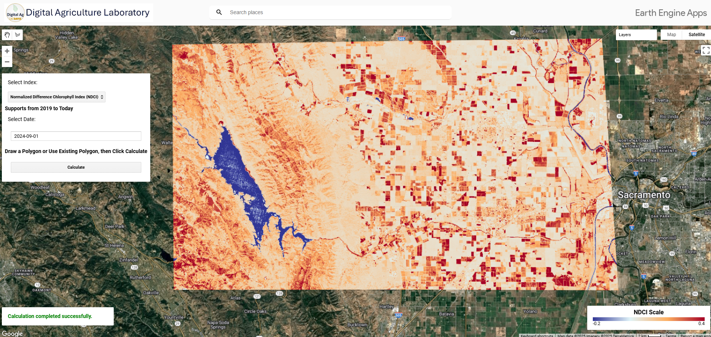

# Sentinel2 Vegetation Index Visualizer

This repository contains a Google Earth Engine (GEE) script developed by the Digital Agriculture Laboratory at the University of California, Davis. The script facilitates dynamic visualization and analysis of multiple vegetation indices using Sentinel-2 imagery for a user-defined region and time period.

## Features

- **Interactive Mapping**: Visualize multiple vegetation indices overlaid on Sentinel-2 RGB imagery.
- **Polygon Drawing**: Users can define their Area of Interest (AOI) by drawing polygons on the map.
- **Date Selection**: Users can input a specific date to filter the satellite imagery.
- **Cloud Masking**: Automatically removes cloudy pixels from Sentinel-2 imagery to enhance the clarity and accuracy of data.
- **Dynamic Legend**: Displays a dynamic legend for the selected vegetation index to assist in data interpretation.
- **Index Visualization**: Supports visualization of indices such as NDVI, ARI, mARI, EVI, and more, each with a corresponding dynamic legend.

## Getting Started

### Prerequisites

Ensure you have access to Google Earth Engine. You can sign up for an account [here](https://signup.earthengine.google.com/).

### Usage Guide

1. **Access the Script**: Navigate to the GEE code editor and access the [Sentinel2_VI_Visualizer](https://code.earthengine.google.com/?accept_repo=users/mnarimani/Sentinel2_VI_visualizer) repository.
2. **Draw a Polygon**: Utilize the polygon tool to define your Area of Interest (AOI) on the map.
3. **Select a Date**: Enter a specific date to filter the imagery.
4. **Choose an Index**: Select a vegetation index from the dropdown menu to visualize.
5. **Calculate and Visualize**: Click the 'Calculate' button to generate the visualization of the selected index. The dynamic legend will adjust based on the index chosen.
6. **Interpret the Data**: Use the generated legend to interpret the visualized data effectively.

## Visualization App

For a more user-friendly experience, access the [Vegetation Index Visualizer App](https://ee-mnarimani.projects.earthengine.app/view/vegetationindexvisualizer), which includes all functionalities directly within a web-based interface.

## Vegetation Indices Visualized

This application visualizes the following indices, retrieved from Sentinel-2 imagery:

- **NDVI** - Normalized Difference Vegetation Index
- **ARI** - Anthocyanin Reflectance Index
- **mARI** - Modified Anthocyanin Reflectance Index
- **CHL_REDEDGE** - Chlorophyll Red-Edge
- **EVI** - Enhanced Vegetation Index
- **GNDVI** - Green Normalized Difference Vegetation Index
- **MCARI** - Modified Chlorophyll Absorption in Reflectance Index
- **MSI** - Moisture Index
- **NDMI** - Normalized Difference Moisture Index
- **NDWI** - Normalized Difference Water Index
- **NDMI STRESS** - Normalized Difference Moisture Index for Crop Moisture Stress
- **NDCI** - Normalized Difference Chlorophyll Index
- **PSSRB1** - Pigment Specific Simple Ratio for Chlorophyll B (800/650)
- **SAVI** - Soil Adjusted Vegetation Index
- **SIPI1** - Structure Insensitive Pigment Index
- **PSRI** - Plant Senescence Reflectance Index

For more information on these indices, visit [Sentinel Hub Custom Scripts](https://custom-scripts.sentinel-hub.com/custom-scripts/sentinel/sentinel-2/).

## Acknowledgments

This project is a collaborative effort by the Digital Agriculture Laboratory at UC Davis, dedicated to advancing the use of remote sensing technology in agriculture.

## Contact

For more information or support, please contact [Mohammadreza Narimani](mailto:mnarimani@ucdavis.edu).
